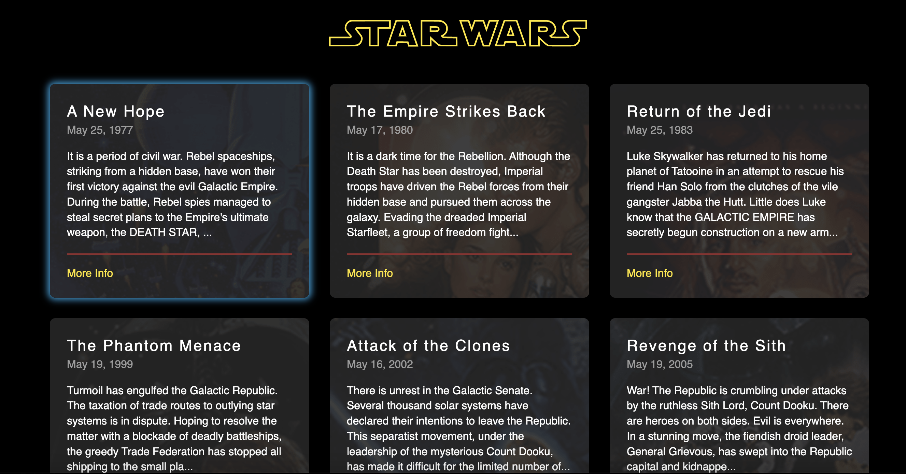
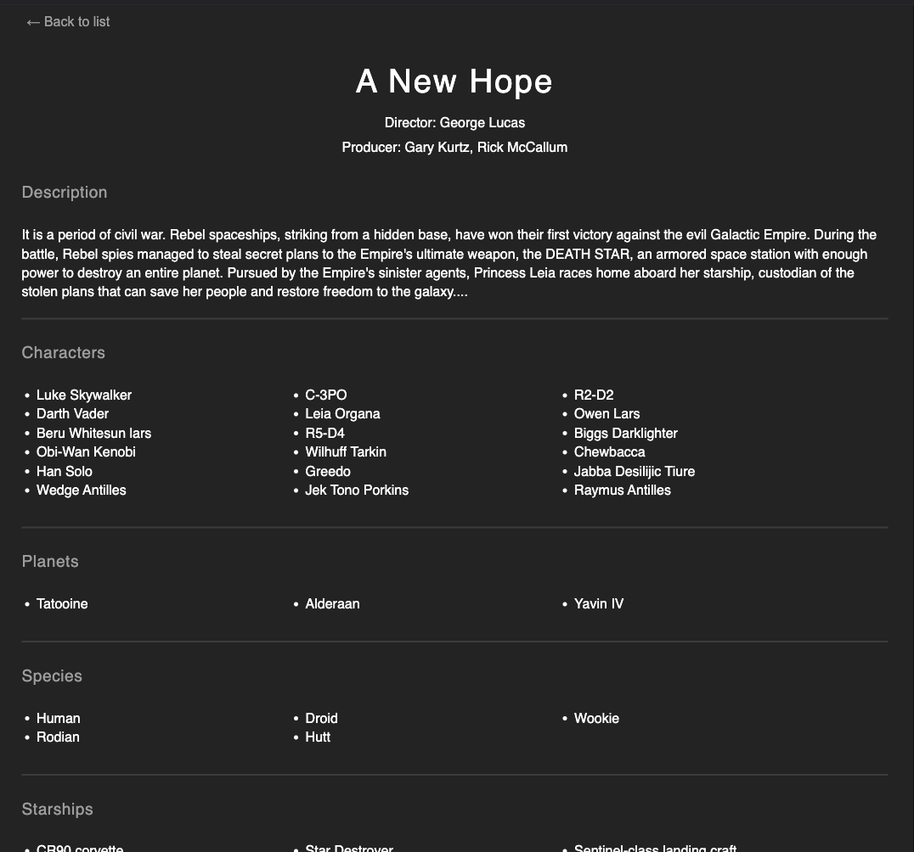

# Star Wars Movies Website

This repository contains the code for a Star Wars movies website, which showcases information about all the Star Wars films using the Star Wars API (SWAPI) available at [swapi.dev](https://swapi.dev/api/films). The website is inspired by [finmavis.github.io/swapi-task](https://finmavis.github.io/swapi-task) and follows the design and layout presented there.It allows users to view the list of movies and access detailed information about each movie.

## Live Demo

## Live Demo

Visit the hosted website here: [https://jade-ganache-504d89.netlify.app/](https://jade-ganache-504d89.netlify.app/)

## Features
## Screenshots

Homepage:

Movie Details Page:

### Compulsory Requirements

- The website displays a **grid layout** listing all the Star Wars movies.
- Each movie card showcases the following information:
  1. Name of the movie
  2. Release date
  3. The opening crawl (displaying the first few lines)
  4. A "More Info" link 
- Each movie card has a **hover effect**, as shown in the example website.
- Clicking on the "Read More" link navigates the user to a details page that displays the specific movie's details.
- The details page includes the following information:
- Movie title
  - Release date
  - Director
  - Producer
  - Opening crawl
- The details page has a "Back to List" link that takes the user back to the Star Wars homepage.

### Optional Requirements

- Each movie card may have a unique **background image** related to the movie.

## API

This project uses the **Star Wars API (SWAPI)** to fetch movie data. You can find more information about the API at [swapi.dev](https://swapi.dev/).